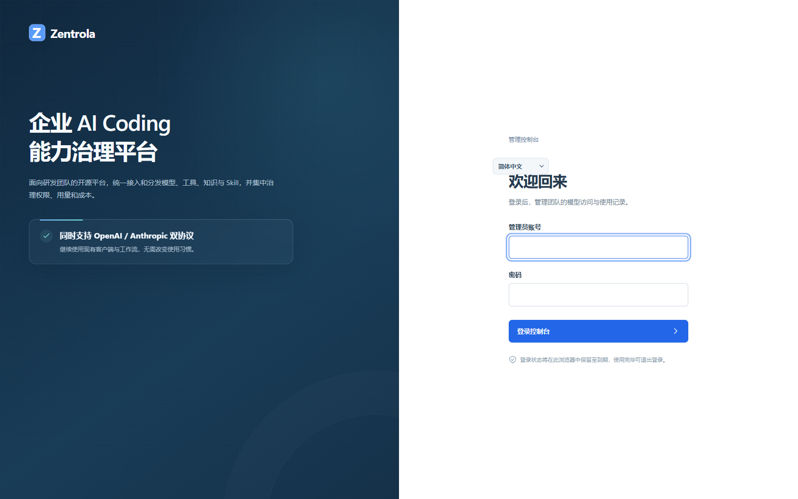

# Zentrola

[English](README.md) | [简体中文](README.zh-CN.md)

[](LICENSE)

Zentrola 是面向研发团队的企业 AI Coding 能力治理平台（AI Coding Control Plane）。

它位于 Codex、Claude Code 等 AI Coding Client 与企业模型订阅之间。研发人员继续使用熟悉的客户端，管理员则统一管理服务商、凭据、逻辑模型、访问权限、Virtual Key、用量和操作记录。

> Zentrola 正在持续开发。当前版本聚焦 Model Governance MVP；Tool、Knowledge、Skill、Cost、计费、SSO 和 APPLICATION Principal 等能力尚未形成完整闭环。



## 为什么使用 Zentrola

- 保留现有 AI Coding Client 和工作习惯。
- 使用成员独立的 Virtual Key，避免向研发人员下发真实 Provider Credential。
- 通过成员、Group 和逻辑模型授权，不再共享上游 API Key。
- 更换服务商、上游模型或凭据时，无需修改客户端使用的逻辑模型编码。
- 统一承接 OpenAI 与 Anthropic 兼容流量，并提供协议转换和服务商故障切换。
- 将调用用量归属到成员、逻辑模型、服务商和凭据。
- 记录重要管理操作，便于追踪和审计。

## 工作方式

```text
Codex / Claude Code / OpenAI 兼容客户端
                    │
               Virtual Key
                    ▼
┌──────────────── Zentrola ────────────────┐
│ 身份认证 → Group 权限 → 逻辑模型         │
│          → Provider 路由 → Usage 记录    │
└──────────────────────────────────────────┘
                    │
        OpenAI / Anthropic / 兼容服务商
                    │
             PostgreSQL / Redis
```

管理面与调用面相互隔离：

- 管理员使用 Admin Web 和 Admin API，通过 Admin JWT 登录。
- 普通成员使用 Virtual Key 调用 Gateway API。
- Admin JWT 不能调用 Gateway，Virtual Key 不能访问 Admin API。

## 当前能力

- 首位管理员初始化、登录、退出、修改密码和密码恢复
- MEMBER 创建、状态管理和删除
- Group 成员管理和 Group Model Allowlist
- 服务商初始化，以及 OpenAI/Anthropic 兼容端点维护
- API Key 加密存储和受支持的 ChatGPT 个人订阅认证
- Provider Credential 连接测试和模型目录手动同步
- 逻辑模型与带优先级的 Provider Model 映射
- Virtual Key 签发、有效期管理和撤销
- Anthropic Messages、Count Tokens、SSE 和工具调用
- OpenAI Models、Chat Completions、Responses、SSE 和工具调用
- 同协议优先、异协议转换和服务商故障切换
- Usage 仪表盘和 Operation Log
- Admin Web 中英文界面

模型目录同步目前为 OpenAI、DeepSeek 和智谱 AI 提供专用适配器。其他 OpenAI 或 Anthropic 兼容服务商可以手动配置。

## 快速开始

### 环境要求

- Windows、macOS 或 Linux 主机
- PostgreSQL 17
- 推荐使用 Redis 保存 Gateway 缓存和路由冷却状态；Redis 暂时不可用时，Gateway 会回退到 PostgreSQL

如果 [GitHub Releases](https://github.com/zentrola/zentrola/releases) 已提供目标操作系统和 CPU 架构的发布包，请优先使用。发布包包含 Backend、Admin Web、静态资源和 `.env.example`。

如果目标平台暂时没有发布包，请参考 [CONTRIBUTING.zh-CN.md](CONTRIBUTING.zh-CN.md) 从源代码构建相同结构的发布包。

### 1. 配置 Zentrola

将 `.env.example` 重命名为 `.env`，至少配置：

```dotenv
APP_ENV=prod

POSTGRES_HOST=127.0.0.1
POSTGRES_PORT=5432
POSTGRES_DB=zentrola
POSTGRES_USER=zentrola
POSTGRES_PASSWORD=请替换为高强度密码

REDIS_HOST=127.0.0.1
REDIS_PORT=6379
REDIS_DB=2
REDIS_PASSWORD=请替换为Redis密码

ADMIN_JWT_SECRET=请替换为至少32个随机字节的Base64字符串

CORS_ENABLED=true
CORS_ALLOWED_ORIGINS=http://127.0.0.1:9528

WEB_API_BASE_URL=http://127.0.0.1:9527
WEB_GATEWAY_BASE_URL=http://127.0.0.1:9527
```

`ADMIN_JWT_SECRET`、数据库密码、Provider Credential 和自动生成的 Master Key 必须彼此独立。

仓库中的 `compose.yaml` 是一个可选的 PostgreSQL 安装示例：

```shell
docker compose up -d postgres
```

该示例默认将 PostgreSQL 发布到宿主机端口 `15432`，使用时需要设置 `POSTGRES_PORT=15432`。

### 2. 启动 Backend 和 Admin Web

macOS/Linux：

```bash
chmod +x zentrola zentrola-web
./zentrola start
./zentrola-web
```

Windows PowerShell：

```powershell
.\zentrola.exe start
.\zentrola-web.exe
```

打开 `http://127.0.0.1:9528`。新安装会要求创建首位管理员；Zentrola 不提供默认用户名或密码。

发布目录、完整配置、前台运行和远程部署说明见[快速开始](docs/getting-started.zh-CN.md)。

## 完成第一次模型调用

登录 Admin Web 后：

1. 初始化或创建服务商。
2. 添加 Provider Credential，测试连接并同步或配置模型映射。
3. 启用准备开放给客户端的逻辑模型。
4. 创建成员和 Group。
5. 将成员加入 Group，并向 Group 授权逻辑模型。
6. 为成员签发 Virtual Key。
7. 将 Gateway 地址、Virtual Key 和逻辑模型编码交给成员。

验证 OpenAI 兼容模型列表：

```bash
curl http://127.0.0.1:9527/v1/models \
  -H "Authorization: Bearer <virtual-key>"
```

发送 OpenAI 兼容对话请求：

```bash
curl http://127.0.0.1:9527/v1/chat/completions \
  -H "Authorization: Bearer <virtual-key>" \
  -H "Content-Type: application/json" \
  -d '{"model":"<logical-model-code>","messages":[{"role":"user","content":"你好"}]}'
```

Anthropic 兼容客户端使用 `http://127.0.0.1:9527/anthropic` 作为 Base URL。支持的路径、认证 Header、Codex、Claude Code 和通用 SDK 示例见[客户端接入](docs/client-configuration.zh-CN.md)。

## 文档

- [快速开始](docs/getting-started.zh-CN.md)
- [客户端接入](docs/client-configuration.zh-CN.md)
- [部署与运维](docs/operations.zh-CN.md)
- [环境变量参考](.env.example)
- [参与贡献](CONTRIBUTING.zh-CN.md)
- [安全策略](SECURITY.zh-CN.md)
- [English documentation index](docs/README.md)

在 `dev` 和 `test` 环境中，Backend 还会在 `/swagger/index.html` 提供 Swagger UI；`prod` 环境不会注册 Swagger 路由。

## 项目状态与边界

当前 MVP 适合验证以成员和 Group 为单位的模型治理。以下能力仍属于后续工作：

- APPLICATION Principal 与 App Key
- Cost、Budget、计费，以及按成本和延迟动态路由
- Enterprise Knowledge、Skill Registry 和 Managed MCP
- SSO、OIDC、LDAP 和 SCIM
- 完整的高可用部署方案

在用于正式生产环境前，请先确认当前能力和限制符合组织要求。

## 参与贡献

欢迎提交 Issue 和 Pull Request。修改 Go、Vue Admin Web、数据库迁移或生成代码前，请先阅读[参与贡献](CONTRIBUTING.zh-CN.md)。

## 安全

不要在 Issue、截图或日志中公开 Provider Credential、Virtual Key、管理员会话、prompt 或模型输出。漏洞报告方式见[安全策略](SECURITY.zh-CN.md)。

## License

本项目使用 [Apache License 2.0](LICENSE) 开源许可证。
